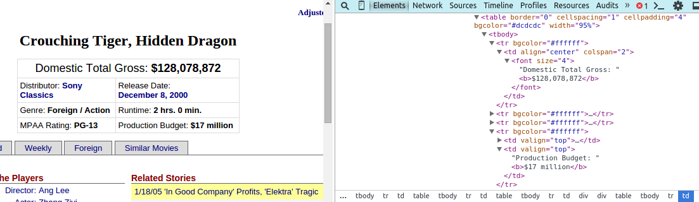
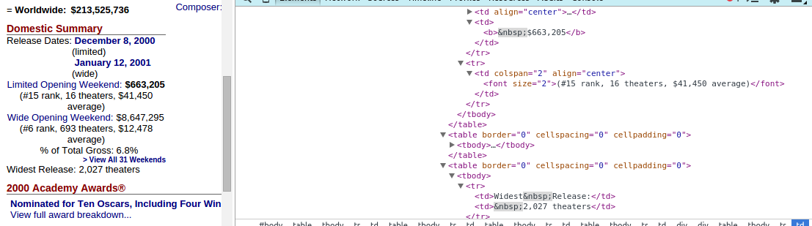

**All of the code mentioned in this post can be found on my [github repo](https://github.com/trishaandrews/movie_analysis), specifically in the `scrape_mojo.py` file.**  

For my second project at Metis, I wanted to predict the success of foreign movies in the US market by looking at factors such as country of origin, genre, opening theaters, etc. That turned out to be much easier said than done, but I'll get into that later.  

Anyway, after deciding what I wanted to look at, I found that the website [BoxOfficeMojo](http://www.boxofficemojo.com/), which shall henceforth be referred to as bomojo, had a handy list of [foreign language films](http://www.boxofficemojo.com/genres/chart/?id=foreign.htm). This seemed pretty perfect, especially since I was unable to find such a list on IMDB or any other easily accessible website. (Netflix has such a genre, but attempting to scrape Netflix seemed like biting off more than I could chew as a newbie web scraper, and I don't want to lose my Netflix account. Though if I wanted to get better results in the future, getting access to Netflix data would probably be necessary)  

For the actual web scraping, I used python and BeautifulSoup to locate the table in the foreign language page that contained all of the movie titles/links and country of origin, where applicable. These were saved in a dictionary of '(title, link)' keys and values of origin country or None, if the country was missing from that bomojo page. I then saved the resulting dictionary as a pickle on my local machine.  

Once I had all the titles and links, it was time to scrape my data from the actual bomojo pages. However, probably as a deterrent to rogue web scrapers, bomojo doesn't seem to add ids to their HTML classes. Because of this, web scraping the site was mostly a lot of trial and error and making sure that I was receiving the correct values. This wasn't too hard for the main information table, because the fields there remained the same even if the data was missing.  
 
Here's the main data table. It almost always has the same layout and you can use Beautiful Soup's `find` and `findNextSibling` functions to get information out of it. I like this table.  

However, in some tables, if a value was unknown the whole field would be missing, and the positioning of siblings versus identifier text would vary depending on the presence or absence of other fields. In fact, the arrangements of elements in the Domestic Summary table were so inconsistent and difficult to identify that I ended up scraping all `td` elements and just parsing the resulting strings separately. There's probably a more clever way of getting at these, but this got the job done without wasting too much time.  

So many tables! Sample Domestic Summary box and HTML:  

The Domestic Summary box contained most all of the information that I was interested in, so besides making a check to see if each film had an Academy Awards section (in other words, if they had been nominated or won an Oscar), I was finished with bomojo. I then made a quick scan of [OMDB](http://www.omdbapi.com/), which returns easy to deal with json results for a given movie title, in order to fill in some of the country data that bomojo was missing.  

At this point, I had a nice set of 1500 foreign films to work with, and, barring sparseness in the data, each movie had its country, budget, domestic lifetime gross, foreign lifetime gross, limited release date, number of limited opening theaters, wide release date, number of wide opening theaters, number of theaters at widest release, a list of genres, and whether they had been up for an academy award. Should be enough to do something interesting, right? Well, more on that next time!
