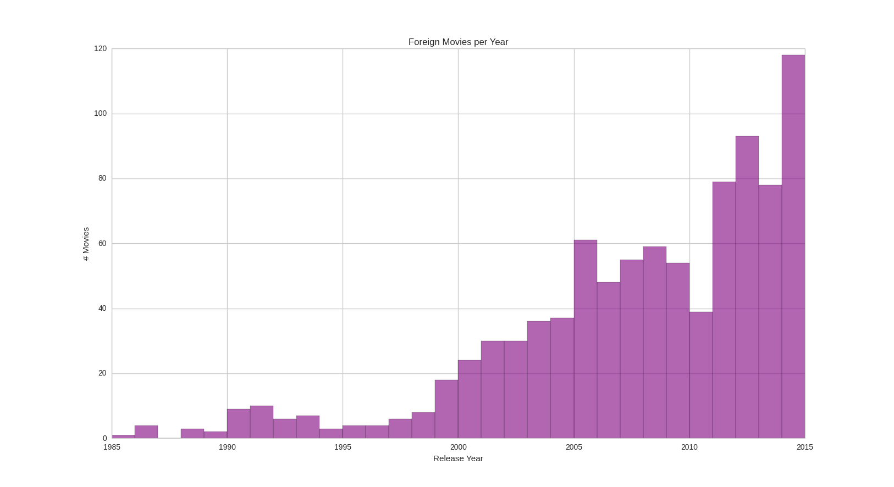
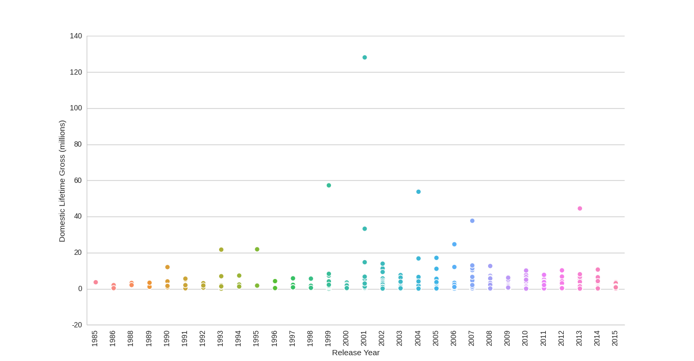
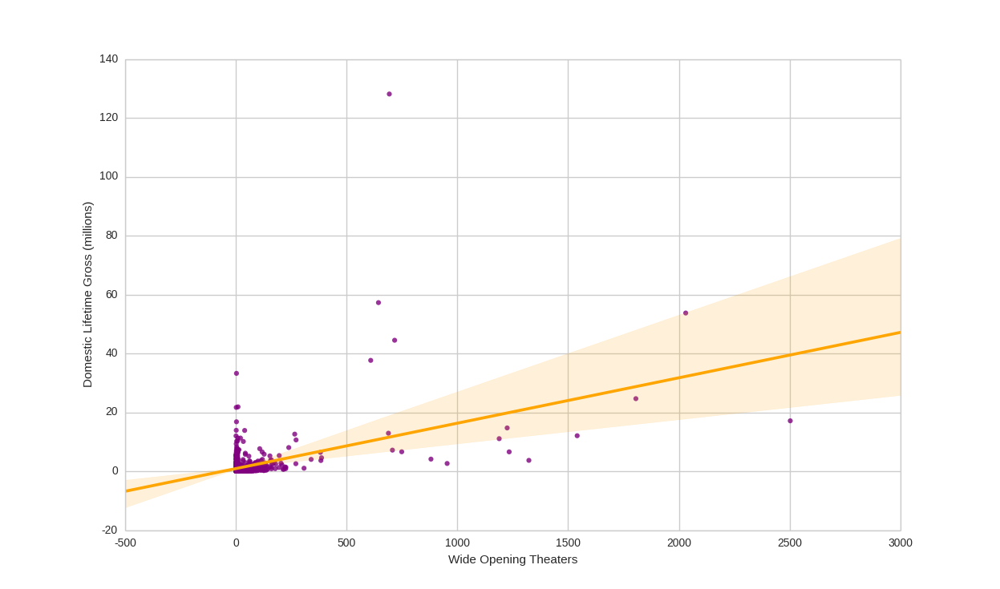
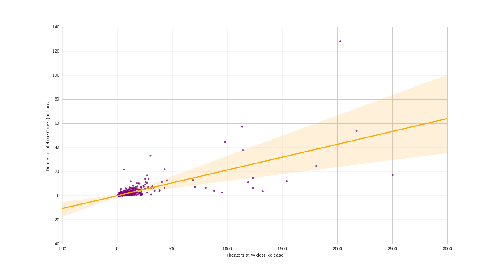
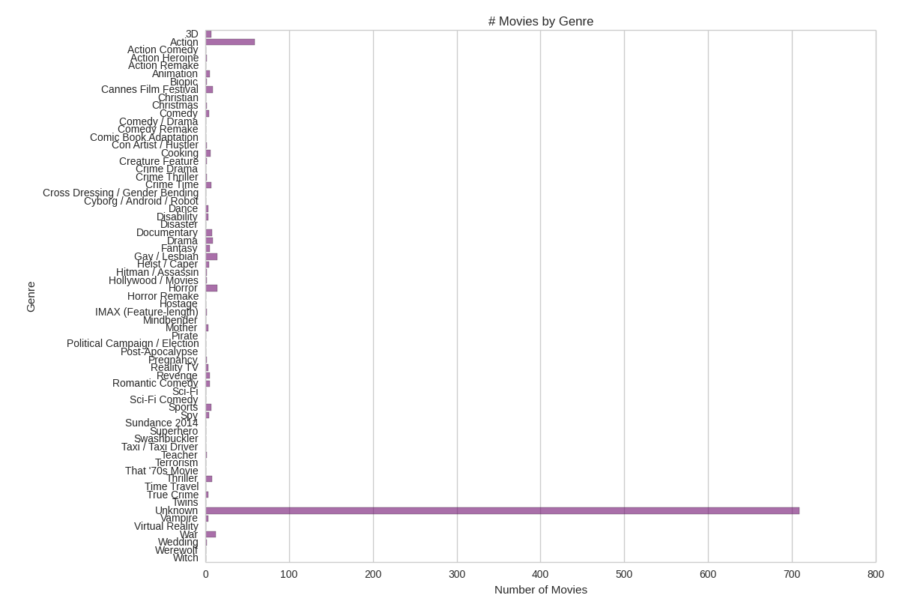
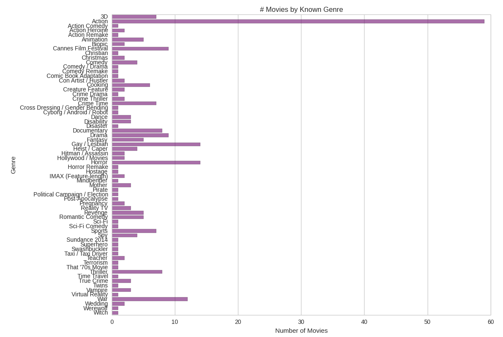
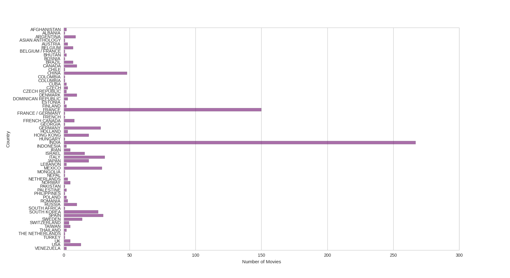
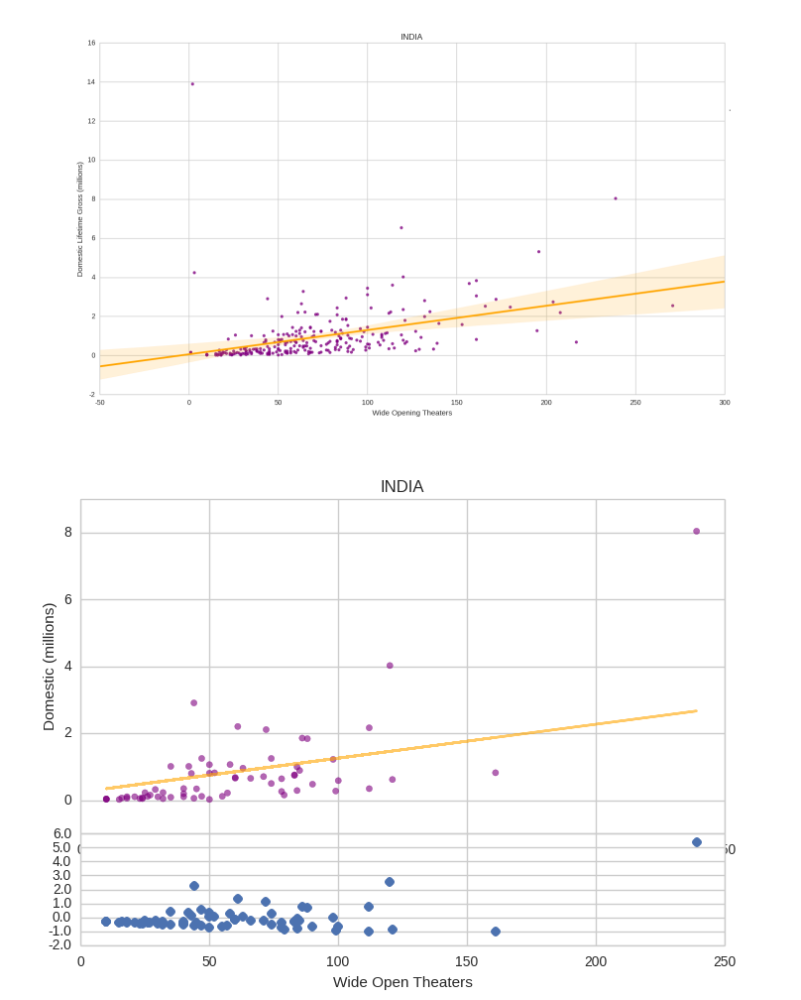
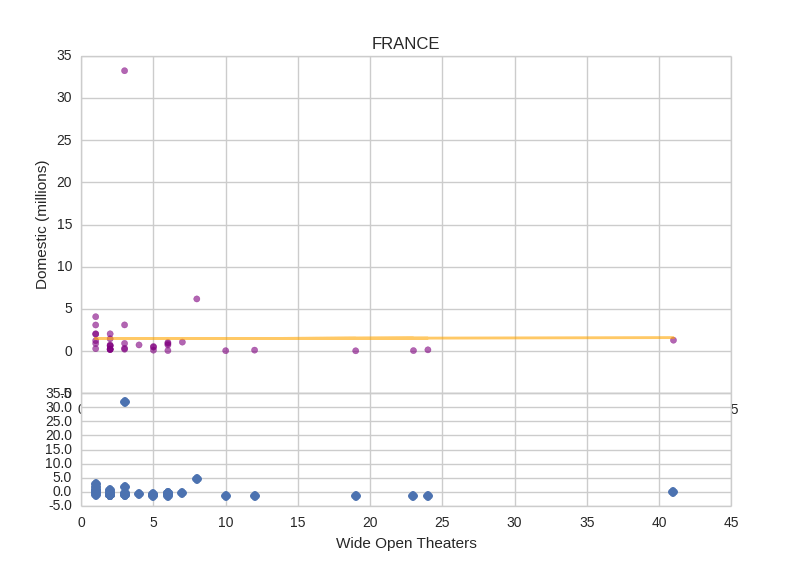

My previous post detailed how I muddled through [BoxOfficeMojo.com](http://www.boxofficemojo.com/) (which I call bomojo) to obtain a list of foreign language films that were released in the US.  

Now with this data I could first run a couple of quick exploratory analyses. First off, it is noticeable how many more foreign language films are being released in the US now versus only a few decades ago.  

Secondly, even though the number of films has been increasing over the years, the amount each one makes in the US does not have such an obvious trend. (Domestic Lifetime Gross refers to the amount made in the USA)  

Furthermore, notice the outlier in 2001. That's *Crouching Tiger, Hidden Dragon*. (Its date is a little awkward since the limited release was in December 2000, but the wide in January 2001. For multiple release dates, I generally use the wide release date) That movie is the permanent outlier in my data set. If there's ever one lonely dot far away from any others in a graph of all my movies, it's *Crouching Tiger, Hidden Dragon*. One of Taiwan's only movies, it made more than double the second place foreign film, Italy's *Life Is Beautiful*. Something else to note is that both movies are in the top spots of total domestic (meaning US) gross even without adjusting for inflation. But anyway, good for you, *Crouching Tiger, Hidden Dragon*. You make my life difficult, but are also always the easiest datapoint to identify, so I like you and will steal your title for my blog post, in honor of how well you've done.  

Moving on, I first tested to see if the US gross for these films could be predicted based on the number of wide opening theaters or foreign gross. The answer: kinda, but not really. The model of US gross per wide opening theaters had an overall R Squared value of 0.21, and can be seen in the graph below, which is a matplotlib plot made prettier with the use of the Seaborn package. Also, note *Crouching Tiger*, way at the top and only about 700 opening theaters.  

  

The R Squared value for domestic vs foreign gross was even worse (a perfect predictor would have an R Square of 1, even with adjusting for the complexity of the model). I also realized that there is the issue that foreign lifetime gross is not something that exists when a movie is first released, and is therefore not applicable when making predictions. The same can be said of the widest number of theaters a movie is ever released in, since a film that is unexpectedly popular can gain theaters over the course of its release. This is seen in the fact that the widest number of theaters is a much more accurate predictor of US gross, with an R Squared value of 0.49 (and *Crouching Tiger* now has over 2000 theaters)  

  

I should probably note here that too few movies had budgets listed for me to make predictions.  

What I was initially curious about was whether genre or country of origin had impacts on a movie's US gross, so let's start out with genre. Each movie had a genre listed, partially do to the fact that I had grabbed this list from bomojo's foreign language genre page. However, when I attempted to get a more accurate view of the data by setting any movies whose only genres were "foreign language" or "foreign" to "unknown", I had an unpleasant surprise -- over 700 of my 1500 movies were now of "unknown" genre.  

  

Well, okay, I guess I'll just take out the unknown ones. What then? Turns out I have almost 60 action movies, but less than 15 of any other genre.

  

Also, from now on, I'm only going to talk about the number of wide opening theaters as the independent variable, along with the genre or country. The others are either not predictive (widest number of theaters, as mentioned above) or both not predictive and inaccurate (foreign lifetime gross).  

I'm uncomfortable running regressions with less than 20 data points, but the action genre contains enough movies to play with. However, I unfortunately had to drop *Crouching Tiger* from these calculations since it was just too much of an outlier. Until this point it really hadn't made much of a difference. It turned out that this genre idea could possibly have some weight to it. For action movies, US gross was related to wide opening theaters with an R Square value of 0.64, and faired even better (~0.8) on most train-test splits (this probably means that there are other, more minor, outliers that throw things off when they are in the testing set).  

  

These results make me kind of happy, though it is somewhat disappointing that I don't have enough data to test other genres, so I can't really say if knowing the genre helps with predicting the US gross, though it certainly seems like it could be that way.  

The other type of data that I do have is country of origin. It turns out that more of the movies in my dataset come from India than any other country.  

However, neither India, France, nor China (the top three in terms of overall numbers of movies) have even 20 movies in a single genre, so I am unable to combine both country and genre to make predictions (such as testing US gross vs opening theaters of Chinese action movies). This is dissappointing, but I can certainly look at country alone.  

India has the most movies, but the R Squares aren't that great, the first graph below is all Indian movies, and the second is only the test set of movies plotted with a prediction line generated from a training set. You can see that the residuals, which are plotted along the bottom, are somewhat close to the zero line, though this is primarily due to the fact that India's outlier-ish movie, *Monsoon Wedding* was apparently in the training set.  

  

The effect of blockbuster movies is even more obvious in France, where it seems that French movies make basically nothing in the US, except for *Amelie*, which made a lot. Here is a train/test split where *Amelie* was in the testing set. Note that all the residuals along the bottom are fairly close to zero, except for *Amelie*, which is above 30.  

  

The countries with fewer movies than the top two seemed to be somewhat predictable based on wide opening theaters, though it is harder to be certain since even China, in the number three spot for total number of movies, had less than five films that opened in more than 500 theaters. Still, China's best movie, *Hero*, opened in over 2000 movies, so it supports the theory that movies opening in more theaters will gross more, rather than counteract it, like most other countries' blockbusters do. Similarly, Mexico seems to follow the pattern quite well, though they only have 29 movies in the data set. Mexico's top movies, *Instructions Not Included* and *Pan's Labyrinth* opened in about 1000 and 600 theaters, respectively, in a trend that would support the significance of larger openings, but there are really too few data points to say for sure.  
 
Overall, there seems to be high variability between countries, though this often seems to relate to whether that country has had a film that was a "blockbuster" hit, such as *Crouching Tiger*, *Life Is Beautiful*, *Amelie*, *Monsoon Wedding*, etc. In general, most foreign films don't seem to make much in the US at all, so even if my predictions are accurate, they are generally predicting that the movies make around $10 million or less. This is also US gross, and it is unclear how this relates to profit for any given film. This is all a little bit sad, though I'm sure there are just as many US movies that also don't make very much.  

Lastly, even people not super familiar with foreign films might be wondering about my lack of mention of certain films. For example, *Princess Mononoke* was one of my favorite movies as a kid, and I'm pretty sure that nearly everyone in my middle school was obsessed with *Spirited Away*. In fact, none of the Miyazaki movies were included in the BoxOfficeMojo list, and for fans of slightly more obscure films, neither were movies such as France's *The Extraordinary Adventures of Adèle Blanc-Sec*. So, a different data set would definitely be necessary for future work. The Netflix listings would probably work, if you work for them or can convince them to let you have their data. Plus, it would be useful to see viewing metrics or download metrics in order to measure success on broader times.
