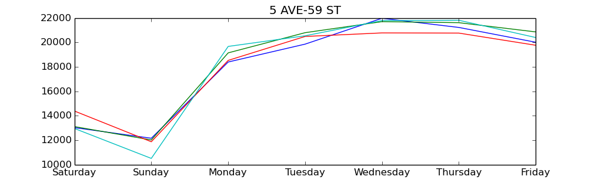

The first week of Metis was mostly spent working on a project to analyze the movement of New Yorkers through [MTA turnstile](http://web.mta.info/developers/turnstile.html) data. 

For this project, we got to create a hypothetical client, in our case the NYPD, and a proposal to show what we could do if they hired us. For our proposal, we worked to see if there were certain stations that were particularly active during the evening hours on the weekends. This could potentially result in the deployment of police to more optimal locations in order to cut down on noise disturbances, drunk and dissorderly offences, etc.

Initially, we cleaned the data by removing outliers of negative or extremely high turnstile counts. In order to get an initial idea of any patterns in the data, we calculated daily total entries per station per week for a small 4 week set of data. 

Next, we filtered the data to only look at exits between the hours of 8pm and 4am. In order to make the data more intuitive, we also adjusted the dates on the dta that fell between midnight and 4am to belong to the previous day. For example, midnight-4am Saturday is considered part of Friday night. 

From here, we could get average nighttime ridership per day of the week, and then separate and aggregate these to achieve average nightly ridership for week days and week ends. Additionally, we decided to exclude Sundays and Thursdays from either count, as Sundays had very low ridership in general and Thursdays could be considered either a weekday or a weekend since people often go out more on Thursdays than on the first three days of the week, but less than on the "weekend" nights of Friday and Saturday.

In general, the stations with the most mean nightly exits, for both weekdays and weekends were:  
- 14th St - Union Sq  
- 34th St - Penn Station  
- 42nd St - Grand Central 
- W 4th St  
- 42nd St - Port Authority 
 
However, some stations with lower volume had a higher proportion of exits on weeknights versus weekends. These included:  
- 51st Street  
- East Broadway  
- Thirty Third St  
- 14th Street  
- 14th St - Union Sq  

These could be locations with busier nightlife, so it might be cool to compare with Uber/Taxi data or noise complaints to get a more complete picture of what's happening there. So, to the hypothetical NYPD client, perhaps these are the locations to be a little more aware of. Though since some of these locations don't really have much traffic in general, well, maybe not.

We also made a cool scatter graph!  

It's a little hard to see the x=y line, so I might fiddle around with the graph a bit more later.

Additionally, we thought it'd be cool do do a quick sketch of a potential user interface for this project. Although we haven't had a chance to look at any additional data sets, this map shows what we might be able to generate down the line. It includes an overlay of the turnstile hotspot data with some lovely icons, drawn by yours truly, indicating certain misdemeanors, sound violations, or areas where there is a predominance of taxi/Uber data relative to subway data.

