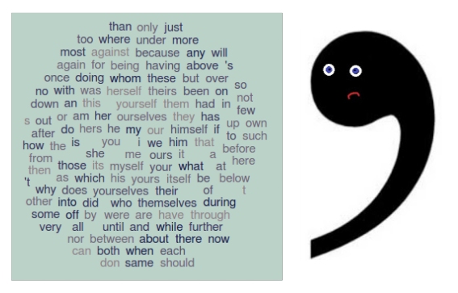
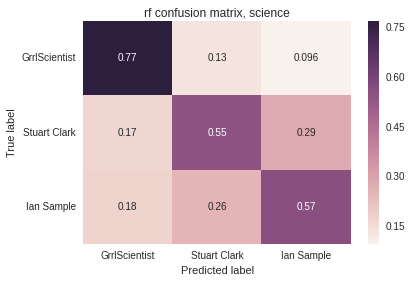

People usually throw out punctuation and stop words such as "and", "the", "of", and "to" because these generally have little impact on topic and sentiment. However, these attributes can help define an author's writing style, so I attempted to predict the author of a sentence with only stop words and punctuation, without looking at any of the "content" words in that sentence. I also looked at whether multiple authors who consistently write on certain topics have similar writing styles as a whole than authors of unrelated topics.  

  
<!--image: https://xyclade.github.io/MachineLearning/-->

  

- Articles from [The Guardian API](http://open-platform.theguardian.com/)
- API gives access to full article text. Most other news sites only provide short summaries or the first paragraph.
- "topic" queries, ex: 'science OR astronomy OR space OR medicine'
- Three or more named authors with > 400 sentences each, per topic
- topics: arts, politics, science, sports  

## The Process  

###  Data collection

- 500 articles most relevant to the designated query
- Collect byline (author) and bodyTextSummary (article body in plaintext)
- Combine articles with the same author
- Split article text into sentences with nltk sent_tokenize
- Only keep authors with > 400 sentences

<table>
<tr>
<td>
Science sentences per author: 
GrrlScientist 506 
Ian Sample 501 
Stuart Clark 464 
</td>
<td>
Sentences per topic: 
arts 2988 
politics 3580 
science 1471 
sports 3604 
</td>
</tr>
</table>

###  Feature generation

- Split each sentence into word/punctuation tokens with nltk word_tokenize
- Compare tokens against (modified) string.punctuation and nltk.corpus stop words and count occurrences
- Convert occurrence counts into abs(log(frequency of occurrence)) because frequencies could be quite small and having negatives is inconvenient for some models

### Analysis and results

- Try all the models!
- Multinomial Naive Bayes, Logistic Regression, Random Forest, and Linear Discriminant Analysis all had roughly the same performance
- No improvement with thresholds for feature frequency or addition of adverbs
- Results **13-30%** better than a good guess

Bests:  
All topics:  
Naive model (best guess) - accuracy: 31%  
Logistic Regression - accuracy: 51%, minimum recall or precision: 14%  

Arts:  
Naive model (best guess) - accuracy: 36%  
Linear Discriminant Analysis - accuracy: 54%, minimum recall or precision: 0.25%  
         
Politics:  
Naive model (best guess) - accuracy: 19%  
Multinomial Naive Bayes - accuracy: 32%, minimum recall or precision: 23%

Science:  
Naive model (best guess) - accuracy: 34%  
Random Forest - accuracy: 64%, minimum recall or precision: 55%  

Sports:  
Naive model (best guess) - accuracy: 23%  
Linear Discriminant Analysis - accuracy: 40%, minimum recall or precision: 25%  

**Confusion matrix for the science authors:**  
  

### Clustering, 'cause reasons

Why are some authors or topics easier to predict than others? Can we visualize the differences in sentence composition? What do these sentences actually look like?

6 clusters for each topic, for simplicity and because the cluster number vs inertia curves leveled out at around 5 or 6 clusters for every topic.  
  

**D3 clusters!**  

- see end of post for select cluster descriptions  

<iframe src="../d3/guardian/index.html" width="650" height="800" style="border:none" scrolling="no"></iframe>

### Looking ahead

News writers probably try to keep their writing styles somewhat uniform and to certain standards, so accuracies could be higher when predicting authors of blog posts.  
If you can predict authors from sentences somewhat accurately, perhaps you could also look at whether some sentence styles were more popular with readers.  

### Selected cluster descriptions

**All topics:**  
cluster: 0, 3847 total sentences  
Shortish (~22 token) sentences, high usage of commas, shortish average token length (~3.7 characters), high frequency of stop words such as "the" and "of" but none of "to", "and", or "in"  

cluster: 1, 3744 total sentences  
Short (~10 token) sentences, short average token length (~3.6 characters), high usage of commas but no stop words.  

cluster: 2, 1089 total sentences  
Medium length (~57 token) sentences, very high comma usage (>1/5 tokens) with no "and"s, and short average token length (~3.43 characters)  

cluster: 3, 16 total sentences  
Very long (~274 token) sentences, stop words such as "for", "to", "what", "we", and "this", possessives, and long dash ("–") punctuation. Token length and frequency of periods and commas unimportant. Only cluster that changes with addition of adverbs (high use of the word "finally")  

cluster: 4, 2736 total sentences  
Medium length (~35 token) sentences, long average token length (~4.5 characters) and high use of the word "a" but not "of" or "to"  

cluster: 5, 211 total sentences  
Long (~95 token) sentences, low frequency of periods relative to other tokens and minimal usage of words such as "and" and "to". Average token length is less important, but long (~4.8 characters)  

**Science:**  
cluster: 0, 531 total sentences  
Shortish (~22 token) sentences and shortish (~3.6 character) average token length. High use of stop words such as "the" and "of"  

cluster: 1, 364 total sentences  
Very short (~8 token) sentences, with short-medium (~3.75 character) average token length. High use of "the" and no commas  

cluster: 2, 9 total sentences  
Long (~101 token) sentences, average token length less important but quite long (~5.0 character). Very high use of the word "of", with additional stop words such as "and", "in", and the character ":". Only a single or few "."s  

cluster: 3, 160 total sentences  
Medium (~42 token) sentences with long (~4.5 character) tokens. Very high usage of "in" and "the", and moderate comma usage  

cluster: 4, 356 total sentences  
Medium (~26 token) sentences with long (~4.9 character) average token length. Use of the words "and" and "of" but not "in" or "a"  

cluster: 5, 51 total sentences  
Long (~62 token) sentences with long (~4.7 character) average token length. Usage of possessives and colons as well as the word "by"  

