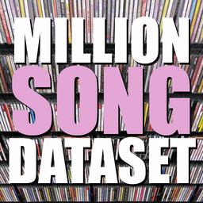
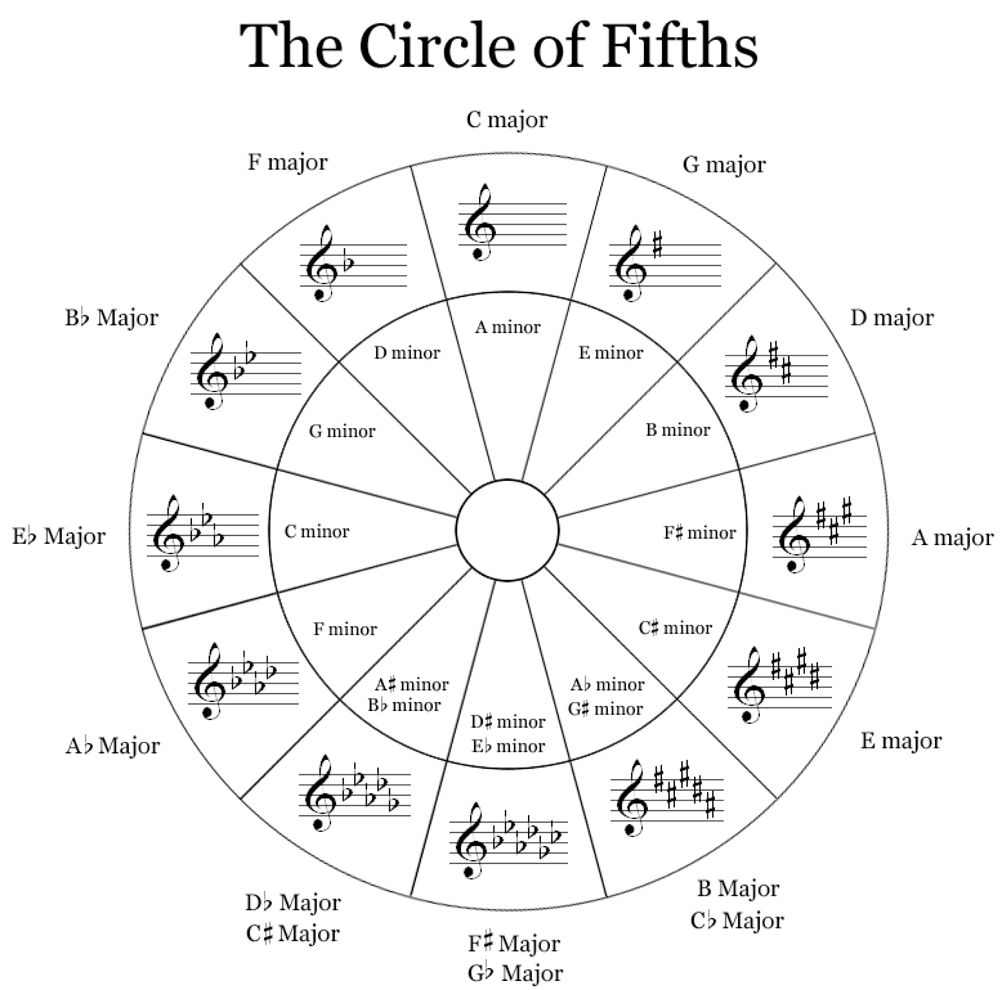

  

It's time for my final project at Metis, and this time I'm going to try writing some thoughts on my project while I'm still in the process of completing it. (Partially because several parts of this project take a somewhat long time to run.) This week I mostly just came up with my idea and began exploring my first(?) data set, the [Million Song Dataset](http://labrosa.ee.columbia.edu/millionsong/).  

##Some background  

So basically, I never listen to music. Not while I'm coding, or walking home, or whenever people usually listen to music. I'll put on some top 20 station when I'm driving, but since I've been in NYC for the summer, I don't think I've intentionally listened to anything in months. And, as you might expect, I never have any idea which artists are good, or cool, or what have you. Still, I like music and would enjoy something to listen to on occasion, but since I'm so out of the loop, it's hard to get started. I do know, though, that I never really listen to the words in songs, that I usually like music that has some sort of rhythmic or instrumental complexity, and that I can find things that I like in pop/rock or instrumental music, so I don't think that genre is a particularly good place to start.  

Why am I talking about all of this? Because, I'm going to try to solve my problem!  
**For this project, I want to make an explorative music recommendation system that will group music by sound and/or style and recommend songs that are similar in those respects, regardless of genre.**  
People are telling me that that's basically what Pandora does, so I guess I should check them out in general, but I still want to see if I can come up with something cool on my own.    

This project involves multiple parts, so hopeful I'll be able to get something done for each one. Two more weeks (ish).  

##Rough sketch of project components/steps  

###Part 0: 

- Get the [subset](http://labrosa.ee.columbia.edu/millionsong/pages/getting-dataset#subset) data from the Million Song Dataset, decide on appropriate features, and get features into a format that I can work with.  

###Part 1:

- Generate groups of songs, similar to genres, but based on the overall style or feel of the music, rather than topic or traditional genre.  

###Part 2:

- Compare these groups against user data to see if individual users generally listen to songs that come from only a small number of groups (indicating that I have good groupings? I'll have to do some thinking if listens are spread across many groups).  

**_Optional but much cooler part 2:_**  

- Get user data from [Last.fm](http://www.last.fm/home), since their listening data comes with timestamps, and see if users generally listen to songs from certain groupings at certain times of day (and/or days of the week). For example, pump-up type music in the mornings, relaxing in the afternoon, and dance at night, or something like that.  

*The time data vs grouping is something that I actually really want to investigate. I'm calling it optional mostly due to the fact that Last.fm is currently transitioning their site and the process of applying for API keys is down, and has been down for over a week. It would probably take much more time to get that data through web scraping, so I'm not sure if it will be feasible given the length of this project*

###Part 3:

- Create some sort of user-facing web app to show off results and possibly generate recommendations based off of some example user profiles or selected attributes.  

##More on part 0:

###The data and the features  

This week, after I figured out what I actually wanted to work on, has been all Part 0. I'm getting my song data from the Million Song Dataset, though at the moment I'm only working with their subset of 10,000 songs. If I want to work with the whole thing I'll have to figure it out on [AWS](http://aws.amazon.com/datasets/6468931156960467) with [Spark](http://spark.apache.org/), probably. And, while it'd be awesome to get a better feel for all of that, I think I'd rather have something to show for each part of my project first.  

Each track of the Million Song Dataset has a variety of features, but for my purposes, I'm only going to be looking at a few. First off, the simple features that are given by the data set of a track's duration, length of intro, tempo, energy, danceability, loudness, mode, key, time signature. Then, the MSD also breaks a song into segments and gives the pitch clarity (0-1) of each pitch (0-11, or -1 if not known) per segment. For now, I'm just going to take the mean, median, and mode of each pitch clarity across all segments, so I can get a standard length array, and still account for some of the pitch quality of the song. I'm also doing a similar thing for timbre, which comes in roughly the same format, and with the maximum loudness values per segment.  

Also, since the data is in a variety of scales (0-1 for many, duration in seconds, tempo in bpm, etc.), I'm standardizing everything by taking the [z-score](https://en.wikipedia.org/wiki/Standard_score) of each feature column and dummying out categorical variables like key.  

##Additional considerations  

The data from the MSD is from December 2010, so there are many track sound features that [Echo Nest](http://the.echonest.com/) has added since it was collected. They look like they would be very helpful, but I'll have to do without for now, in the interest of time and just getting a minimum viable product. If you want to read more about the features I'm using as well as the ones that have been added since, check out Echo Nest's awesome [documentation](http://the.echonest.com/) on their song analyzer.  

It would also be possible to do some much more complicated rhythmic analysis by looking at their tatums and bars and such, but I'm going to leave that alone for now.   

Another thing that would be interesting but is probably beyond what I can do with my current time frame is to use/calculate a specialized distance metric for keys or pitches based on how they actually relate to each other in the musical system.   

  

For example, I'm currently going to treat key designations as categorical variables while trying to capture some musical intricacies with simply the average pitch clarities, but it would make more sense to have keys treated as numerical values and use a distance metric where a certain key would measure as close to maybe the neighboring keys along the circle of fifths and perhaps its relative minor.  
