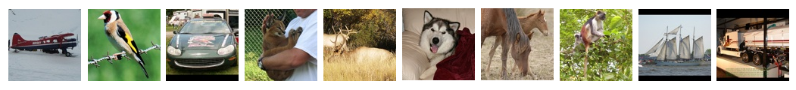
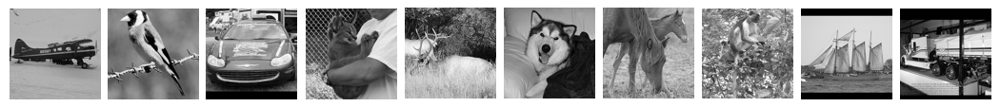
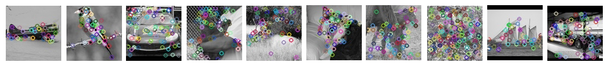
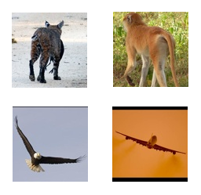
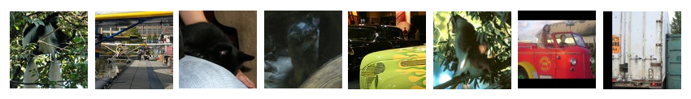
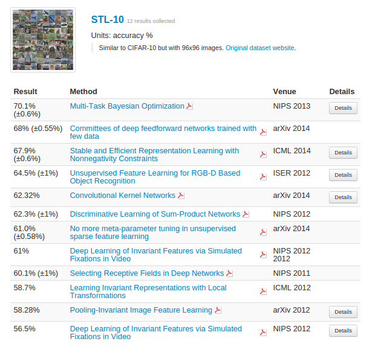

<link rel="stylesheet" href="../blog/heatmap.css" />

<!--<head>-->

<!--</head>

<body>-->
  

## The Data  

- Stanford [STL-10 dataset](http://cs.stanford.edu/~acoates/stl10/)
- 10 classes: airplane, bird, car, cat, deer, dog, horse, monkey, ship, truck
- 96x96 px, 3 channel RGB images
- 500 training images, 800 test images per class
- 100000 unlabeled images for unsupervised learning  

## The Process  

###  Grayscale

Color is not generally a useful feature for object classification, so convert all images to grayscale.  

###  Features  

**Harris Corners**

**Pros:**  

- Easy to understand
- Somewhat customizable  

**Cons:**  

- Sensitive to noise/patterns  

Didn't end up using in final models  
  
<!--  
-->
**SIFT (Scale-Invariant Feature Transform)**

- Proprietary ([David Lowe](https://en.wikipedia.org/wiki/David_G._Lowe), 1999/2004)  
- Confusing (Difference of Gaussians to generate feature vectors in 128 dimensional space)  
- Works well  

<!--  -->

Cluster features with k-means, compute feature occurrence histograms, and feed those to the models for train/test.  

## The Results (confusion matrix)  

<iframe src="../d3/imageclassif1/index.html" width="650" height="750" style="border:none" scrolling="no"></iframe>
<!--

<table style="height:60px; width:80%; text-align: center; align: center">
  <tr>
    <td>
    <table >
        <tr>
         

            <label for="lim" 
                style="display: inline-block; text-align: center">
            Training Images:
            </label>
            <input type="range" min="1" max="510" id="lim" value="500">
        

        </tr>
        <tr>
         

            <label for="k" 
                style="display: inline-block; text-align: center">
            Feature Centers:
            </label>
            <input type="range" min="1" max="310" id="k" value="300">
        

        </tr>
    </table>
    </td>
    <td>
    <table>
    <tr><!--
    Model:
    <select id="model">
    <option value="nomodel">----</option>
    <option value="mnb" selected>Multinomial Naive Bayes</option>
    <option value="gnb">Gaussian Naive Bayes</option>
    <option value="linsvc">Linear SVC</option>
    <option value="logreg">Logistic Regression</option>
    <option value="rf">Random Forrest</option>
    <option value="tree">Decision Tree</option>
    </select> --
    </tr>
    <tr>
    

      <label for="mname" 
         style="display: inline-block; text-align: center">
         Model Slider:
      </label>
      <input type="range" min="1" max="600" id="mname" value="600">
    

    </tr>
    </table>
    </td>
  </tr>
</table>
  -->
## Image classification is hard  

Cat-Monkey and Bird-Plane  
  
Some images are just odd. A couple of these made me take a second look at their assigned labels. Can you classify them? (results on hover)  
  

**Results and Other Research**  

My best models are over three times better than guessing, and, according to [this website](http://rodrigob.github.io/are_we_there_yet/build/classification_datasets_results.html), I happened to pick a fairly difficult dataset. I also didn't get time to address the unlabeled images, which is where this dataset really excels. I guess I'll just have to experiment with deep learning next time!  
  

